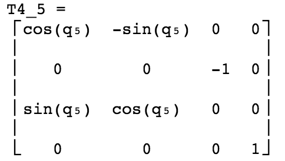
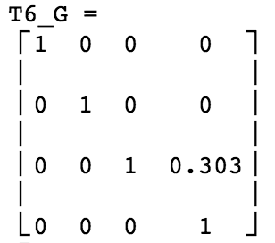

## Project: Kinematics Pick & Place

---


**Steps to complete the project:**  


1. Set up your ROS Workspace.
2. Download or clone the [project repository](https://github.com/udacity/RoboND-Kinematics-Project) into the ***src*** directory of your ROS Workspace.  
3. Experiment with the forward_kinematics environment and get familiar with the robot.
4. Launch in [demo mode](https://classroom.udacity.com/nanodegrees/nd209/parts/7b2fd2d7-e181-401e-977a-6158c77bf816/modules/8855de3f-2897-46c3-a805-628b5ecf045b/lessons/91d017b1-4493-4522-ad52-04a74a01094c/concepts/ae64bb91-e8c4-44c9-adbe-798e8f688193).
5. Perform Kinematic Analysis for the robot following the [project rubric](https://review.udacity.com/#!/rubrics/972/view).
6. Fill in the `IK_server.py` with your Inverse Kinematics code. 

![alt text][image1]

[//]: # (Image References)

[image1]: ./misc_images/misc1.png
[image2]: ./misc_images/misc3.png
[image3]: ./misc_images/misc2.png
[kine]: ./misc_images/Kinematics_analysis.jpg
[t0_1]: ./misc_images/T0_1.png
[t1_2]: ./misc_images/T1_2.png
[t2_3]: ./misc_images/T2_3.png
[t3_4]: ./misc_images/T3_4.png
[t4_5]: ./misc_images/T4_5.png
[t5_6]: ./misc_images/T5_6.png
[t6_G]: ./misc_images/T6_G.png
[t0_G]: ./misc_images/T0_G.png
[theta2_3]: ./misc_images/analysis_2_3.jpg
[t3_6]: ./misc_images/R3_6.png
[result]: ./misc_images/result_kuka.png
[delta_sag]: ./misc_images/delta_sag.jpg

## [Rubric](https://review.udacity.com/#!/rubrics/972/view) Points
### Here I will consider the rubric points individually and describe how I addressed each point in my implementation.  

---
### Writeup / README

### Kinematic Analysis
#### 1. Run the forward_kinematics demo and evaluate the kr210.urdf.xacro file to perform kinematic analysis of Kuka KR210 robot and derive its DH parameters.

![alt text][kine]

With information from kr210.urdf, we can derive DH paramters:

d1 = 0.33 + 0.42 = 0.75
d4 = 1.5
dG = 0.193 + 0.11 = 0.303
d2 = d3 = d5 = d6 = 0

a1 = 0.35
a2 = 1.25
a3 = -0.054
a0 = a4 = a5 = a6 = 0

#### 2. Using the DH parameter table you derived earlier, create individual transformation matrices about each joint. In addition, also generate a generalized homogeneous transform between base_link and gripper_link using only end-effector(gripper) pose.

* ##### DH parameters

Links | alpha(i-1) | a(i-1) | d(i-1) | theta(i)
--- | --- | --- | --- | ---
0->1 | 0 | 0 | 0.75 | q1
1->2 | - pi/2 | 0.35 | 0 | -pi/2 + q2
2->3 | 0 | 1.25 | 0 | q3
3->4 |  - pi/2 | -0.054 | 1.5 | q4
4->5 | pi/2 | 0 | 0 | q5
5->6 | - pi/2 | 0 | 0 | q6
6->EE | 0 | 0 | 0.303 | 0

* ##### Transformation matrices about each joint

  
  
 

* ##### Generalized homogeneous transform between base_link and gripper_link

The transform below can be derived by roll, pitch, yaw transformation including translation to the pose of gripper_link

```python
qx = symbols('qx')
qy = symbols('qy')
qz = symbols('qz')
x = symbols('x')
y = symbols('y')
z = symbols('z')
Rzyx = rot_z(qz) * rot_y(qy) * rot_x(qx)
T = Rzyx.row_insert(3, Matrix([[0, 0, 0]]))
T = T.col_insert(3, Matrix([x, y, z, 1]))
pprint(T)
```

![alt text][t0_G]

#### 3. Decouple Inverse Kinematics problem into Inverse Position Kinematics and inverse Orientation Kinematics; doing so derive the equations to calculate all individual joint angles.

* ##### Obtain Theta1 (q1)

From the `orientation` and `position` of end effector, we can construct the end effector pose matrix (`ee_pose`), and then conduct the transformation matrix of end effector according to base (`ee_base`)

To correct the difference between the end effector frame defined in DH parameters and URDF, the `ee_pose` needs to be multipled by a correctional rotation matrix which will rotate it around z-axis and y-axis 180 and -90 degrees

```python
ee_pose = numpy.dot(tf.transformations.translation_matrix((position.x, position.y, position.z)),
                   tf.transformations.quaternion_matrix((orientation.x, orientation.y, orientation.z, orientation.w)))
qz = tf.transformations.rotation_matrix(pi, (0,0,1))    
qy = tf.transformations.rotation_matrix(-pi/2, (0,1,0))    
R_corr = numpy.dot(qz, qy)
ee_base = numpy.dot(ee_pose, R_corr)
``` 

From `ee_base`, wrist position can be derived and `theta1` can be calculated

```python 
wrist_pos = ee_base[0:3, 3] - 0.303 * ee_base[0:3, 2]        
q1 = numpy.arctan2(wrist_pos[1], wrist_pos[0])
```

* ##### Obtain Theta2 (q2), Theta3 (q3)

![alt text][theta2_3]

First, side C of the triangle can be calculated using Cosine Laws. Note that the vector from `2` to `wrist center` (`vec_J2_W`) can be conducted by substracting position of wrist for position of joint 2. And joint 2 position is derived by forward kinematics using `theta1` calculated above.

Another difference between URDF and DH table is that the wrist center was placed at the origin of joint 5 (refer to the picture below). Therefore, it can be corrected by recalculate the vector from `3` to `WC` based on `link 3` and `link 4`. In addtion, the angle of `theta3` needs to be corrected by an amount of Delta which is the angle between vector `3WC` and `link 3_4`

![alt text][delta_sag]

```python
# find vector connect joint 2 with wrist
# calculate triangle's side oppsition with theta3
vec_J2_W = numpy.subtract(wrist_pos, self.get_joint2_position(q1))
side_B = self.vec_len(vec_J2_W)
side_d4_cor = numpy.sqrt(self.d4**2 + self.a3**2)
delta = numpy.arctan2(abs(self.a3), self.d34) - numpy.arctan2(abs(self.a3), self.d4)
# find theta 3 prime which expresses the relative angle with theta 2
c3_prime = (side_B**2 - self.a2**2 - side_d4_cor**2) / (2 * self.a2 * side_d4_cor)
prime3 = numpy.arctan2(numpy.sqrt(1 - (c3_prime**2)), c3_prime)
``` 

As mentioned in the graph, Rviz defines joint 3 angle according to a right angle with `link 2` also there is small angle between `link 3` and `wrist center`. `Theta 3` should be

```python 
q3 = prime3 - (numpy.pi/2) - delta
```

Also, from the graph, `beta` and `gamma` need to be determined in order to calculate `theta 2`. Those angles can be computed using trigonometry

```python
beta = numpy.arctan2(vec_J2_W[2], numpy.sqrt(vec_J2_W[0]**2 + vec_J2_W[1]**2))
gamma = numpy.arctan2(Kuka.d4 * numpy.sin(prime3), Kuka.d4 * numpy.cos(prime3) + Kuka.a2)
q2 = (numpy.pi/2) - beta - gamma
```

* ##### Obtain Theta4 (q4), Theta5 (q5), Theta6 (q6) 

For inverse orientation, it can start with 

```
R0_6 = Rrpy
```

where,

Rrpy = Homogeneous RPY rotation between base_link and gripper_link as calculated above.

Substitue joints 1, 2 and 3 into the equation above, it becomes

```
R3_6 = inv(R0_3) * Rrpy
```

As the right hand side of the equation does not have any variables, the values of joint 4, 5, 6 can be derived by comparing the left hand side of equation with the right hand side. The left hand side of the equation has this form ( we can ignore the translation part)

![alt text][t3_6]

`Theta 5` can be calculated right away by comparing the element in row 2, column 3 of the matrix (`cos(q5)`)

```python
theta5 = numpy.arctan2( numpy.sqrt(1 - T3_6[1][2]**2), T3_6[1][2])
```

Note that `theta 5` has multiple solution which depends on the sign of `numpy.sqrt(1 - T3_6[1][2]**2)`. In this project, I choose positive value of `sin(theta5)`. 

`Theta 4` can be calculated by dividing the element in row 3, column 3 for row 1, column 3 `sin(q₄)⋅sin(q₅)/sin(q₅)⋅cos(q₄)`, and `Theta 6` is similar. Note that value of `theta 4` and `theta 6` are affected by the value of `theta 5`. When `theta 5` it will yield the singularity problem.

```python
theta4 = numpy.arctan2( T3_6[2][2], -T3_6[0][2])
theta6 = numpy.arctan2( -T3_6[1][1], T3_6[1][0])
```

### Project Implementation

![alt text][image3]
#### 1. Code implement

I implement a class of Kuka robot with `IK` to return theta configurations according to the position and orientation of end effector. 

```python
class KukaR210:
    def __init__(self):
      ...

    def get_dh_transformation(self, alpha, a, d, theta):
      ...

    # Get joint2 position 
    def get_joint2_position(self, q1):        
      ...

    def get_T0_3_inv(self, q1, q2, q3):
      ...

    def get_ee_pose_base(self, position, orientation):
      ...

    def get_wrist_position(self, ee_base):
      ...

    def vec_len(self, vec):
      ...

    def IK(self, ee_position, ee_orientation):
        # calculate wrist position from ee position and orientation
        ee_base = self.get_ee_pose_base(ee_position, ee_orientation)
        wrist_pos = self.get_wrist_position(ee_base)

        # calculate theta1 by wrist position
        q1 = numpy.arctan2(wrist_pos[1], wrist_pos[0])

        # calculate triangle's side oppsition with theta3
        vec_J2_W = numpy.subtract(wrist_pos, self.get_joint2_position(q1))
        side_B = self.vec_len(vec_J2_W)

        # find theta 3 prime which expresses the relative angle with theta 2
        c3_prime = (side_B**2 - self.a2**2 - self.d4**2) / (2 * self.a2 * self.d4)
        prime3 = numpy.arctan2(numpy.sqrt(1 - (c3_prime**2)), c3_prime)

        # find theta2 and theta3
        beta = numpy.arctan2(vec_J2_W[2], numpy.sqrt(vec_J2_W[0]**2 + vec_J2_W[1]**2))
        gamma = numpy.arctan2(Kuka.d4 * numpy.sin(prime3), Kuka.d4 * numpy.cos(prime3) + Kuka.a2)

        q2 = (numpy.pi/2) - beta - gamma
        q3 = prime3 - (numpy.pi/2)

        # get T3_6 
        T0_3_inv = self.get_T0_3_inv(q1, q2, q3)
        T3_6 = numpy.dot(T0_3_inv, ee_base)

        # calculate theta4, theta5, theta6
        q4 = numpy.arctan2( T3_6[2][2], -T3_6[0][2])
        q5 = numpy.arctan2( numpy.sqrt(1 - T3_6[1][2]**2), T3_6[1][2])
        q6 = numpy.arctan2( -T3_6[1][1], T3_6[1][0])

        return (q1, q2, q3, q4, q5, q6)
```

#### 2. Result

Kuka can bring (10/10) objects to the bin. 

![alt text][result]

#### 3. Future Enhancements

As arctan2 returns angle in [0, pi] or [0, -pi] while joint 4 and 6 have 350 degrees operation range, it causes unnecessary turn when angles of joint 4 and 6 excess abs(pi). This problem can be resolved by post-processing the result which will map the angle to [0, 2pi] if there is a sudden jump from positive to negative and vice versa in the angles of joint 4 and 6.

I found the movement of Kuka not as smooth as the demo although I implemented the IK process using numpy function solely and the calculation already finished before the robot started its movement. Also, the result is not consistent, robot still dropped the objects couple times.

I am keen on implementing speed controller based on Jacobian method.

